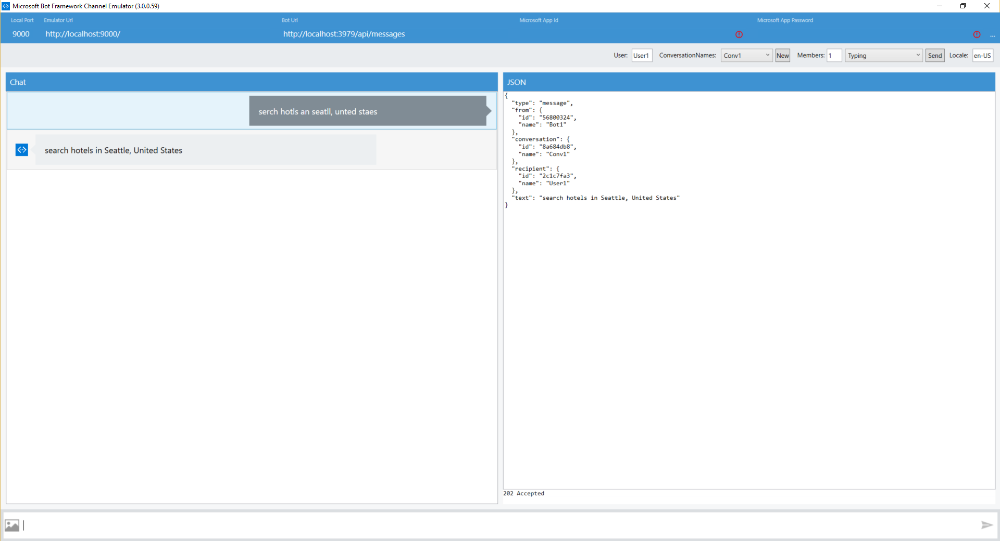

# Spell Check Bot Sample

A sample bot that illustrates how to use the [Microsoft Bing Spell Check API](https://www.microsoft.com/cognitive-services/en-us/bing-spell-check-api) to correct the spelling of the text sent by the user.

[](https://azuredeploy.net)

### Prerequisites

The minimum prerequisites to run this sample are:
* The latest update of Visual Studio 2015. You can download the community version [here](http://www.visualstudio.com) for free.
* The Bot Framework Emulator. To install the Bot Framework Emulator, download it from [here](https://aka.ms/bf-bc-emulator). Please refer to [this documentation article](https://docs.botframework.com/en-us/csharp/builder/sdkreference/gettingstarted.html#emulator) to know more about the Bot Framework Emulator.
* This sample currently uses a free trial Microsoft Bing Spell Check API key with limited QPS. Please subscribe [here](https://www.microsoft.com/cognitive-services/en-us/subscriptions?productId=/products/56ec2df6dbe2d91324586008) to obtain your own key and update the `BingSpellCheckApiKey` key in [Web.config](Web.config) file to try it out further.

### Code Highlights

Microsoft Bing Image Spell Check API provides a module that allows you to to correct the spelling of the text. Check out the [reference](https://dev.cognitive.microsoft.com/docs/services/56e73033cf5ff80c2008c679/operations/56e73036cf5ff81048ee6727) to know more about the modules available. In this sample we are using the `POST` API to correct the spelling of the message `https://api.cognitive.microsoft.com/bing/v5.0/spellcheck/` 

The main logic that handles calling the Bing Spell Check API can be found in [BingSpellCheckService.cs](Services/BingSpellCheckService.cs).

The method `GetCorrectedTextAsync(string text)` illustrates how to get the corrected text:

````C#
/// <summary>
        /// Gets the correct spelling for the given text
        /// </summary>
        /// <param name="text">The text to be corrected</param>
        /// <returns>string with corrected text</returns>
        public static async Task<string> GetCorrectedTextAsync(string text)
        {
            using (var client = new HttpClient())
            {
                client.DefaultRequestHeaders.Add("Ocp-Apim-Subscription-Key", ApiKey);

                var values = new Dictionary<string, string>
                {
                    { "text", text }
                };

                var content = new FormUrlEncodedContent(values);

                var response = await client.PostAsync(SpellCheckApiUrl, content);
                var responseString = await response.Content.ReadAsStringAsync();

                var spellCheckResponse = JsonConvert.DeserializeObject<BingSpellCheckResponse>(responseString);

                StringBuilder sb = new StringBuilder();
                int currentOffset = 0;

                foreach (var flaggedToken in spellCheckResponse.flaggedTokens)
                {
                    sb.Append(text.Substring(currentOffset, flaggedToken.offset - currentOffset));

                    sb.Append(flaggedToken.suggestions.First().suggestion);

                    currentOffset = flaggedToken.offset + flaggedToken.token.Length;
                }

                if (currentOffset < text.Length)
                {
                    sb.Append(text.Substring(currentOffset));
                }

                return sb.ToString();
            }
        }
````

### Outcome

You will see the following when connecting the Bot to the Emulator and send it an image or a URL:

Input:

`serch hotls an seatll, unted staes`

Output:

`search hotels in Seattle, United States`



### More Information

To get more information about how to get started in Bot Builder for .NET and Microsoft Bing Spell Check API please review the following resources:
* [Bot Builder for .NET](https://docs.botframework.com/en-us/csharp/builder/sdkreference/index.html)
* [Microsoft Bing Spell Check API](https://www.microsoft.com/cognitive-services/en-us/bing-spell-check-api)
* [Microsoft Bing Spell Check API Reference](https://dev.cognitive.microsoft.com/docs/services/56e73033cf5ff80c2008c679/operations/56e73036cf5ff81048ee6727)
