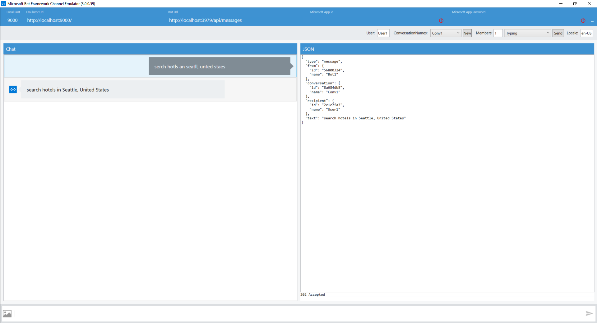

# Spell Check Bot Sample

A sample bot that illustrates how to use the [Microsoft Bing Spell Check API](https://www.microsoft.com/cognitive-services/en-us/bing-spell-check-api) to correct the spelling of the text sent by the user.

[](https://azuredeploy.net)

### Prerequisites

The minimum prerequisites to run this sample are:
* Latest Node.js with NPM. Download it from [here](https://nodejs.org/en/download/).
* The Bot Framework Emulator. To install the Bot Framework Emulator, download it from [here](https://aka.ms/bf-bc-emulator). Please refer to [this documentation article](https://docs.botframework.com/en-us/csharp/builder/sdkreference/gettingstarted.html#emulator) to know more about the Bot Framework Emulator.
* **[Recommended]** Visual Studio Code for IntelliSense and debugging, download it from [here](https://code.visualstudio.com/) for free.
* This sample currently uses a free trial Microsoft Bing Spell Check API key with limited QPS. Please subscribe [here](https://www.microsoft.com/cognitive-services/en-us/subscriptions?productId=/products/56ec2df6dbe2d91324586008) to obtain your own key and update the `BING_Spell_Check_API_KEY` key in [.env](.env) file to try it out further.

### Code Highlights

Microsoft Bing Image Spell Check API provides a module that allows you to to correct the spelling of the text. Check out the [reference](https://dev.cognitive.microsoft.com/docs/services/56e73033cf5ff80c2008c679/operations/56e73036cf5ff81048ee6727) to know more about the modules available. In this sample we are using the `POST` API to correct the spelling of the message `https://api.cognitive.microsoft.com/bing/v5.0/spellcheck/` 

The main components are:

* [spell-service.js](spell-service.js): is the core component illustrating how to call the Bing Spell Check RESTful API.
* [app.js](app.js): is the bot service listener receiving messages from the connector service and passing them down to spell-service.js and correcting the spelling.

In this sample we are using the API to correct the spelling of the text and send it back to the user. Check out the use of the `spellService.getCorrectedText(text)` method in [app.js](app.js).

````JavaScript
if (session.message.text) {
    spellService
        .getCorrectedText(session.message.text)
        .then(text => session.send(text))
        .catch(error => handleErrorResponse(session, error));
}
````
and here is the implementation of `spellService.getCorrectedText(text)` in [spell-service.js](spell-service.js)
````JavaScript
/**
 * Gets the correct spelling for the given text
 * @param {string} text The text to be corrected
 * @returns {Promise} Promise with corrected text if succeeded, error otherwise.
 */
exports.getCorrectedText = text => {
    return new Promise(
        (resolve, reject) => {
            
            const requestData = {
                url: SPELL_CHECK_API_URL,
                headers: {
                    "Ocp-Apim-Subscription-Key": SPELL_CHECK_API_KEY
                },
                form: {
                    text: text
                },
                json: true
            }

            request.post(requestData, (error, response, body) => {
                if (error) {
                    reject(error);
                }
                else if (response.statusCode != 200) {
                    reject(body);
                }
                else {
                    var currentOffset = 0;
                    var result = "";

                    for (var i = 0; i < body.flaggedTokens.length; i++) {
                        var element = body.flaggedTokens[i];

                        result += text.substring(currentOffset, element.offset);

                        result += element.suggestions[0].suggestion;

                        currentOffset = element.offset + element.token.length;
                    }

                    if (currentOffset < text.length) {
                        result += text.substring(currentOffset);
                    }

                    resolve(result);
                }

            });
        }
    )

}
````

### Outcome

You will see the following when connecting the Bot to the Emulator and send it an image or a URL:

Input:

`serch hotls an seatll, unted staes`

Output:

`search hotels in Seattle, United States`



### More Information

To get more information about how to get started in Bot Builder for Node and Microsoft Bing Spell Check API please review the following resources:
* [Bot Builder for Node.js Reference](https://docs.botframework.com/en-us/node/builder/overview/#navtitle)
* [Microsoft Bing Spell Check API](https://www.microsoft.com/cognitive-services/en-us/bing-spell-check-api)
* [Microsoft Bing Spell Check API Reference](https://dev.cognitive.microsoft.com/docs/services/56e73033cf5ff80c2008c679/operations/56e73036cf5ff81048ee6727)
